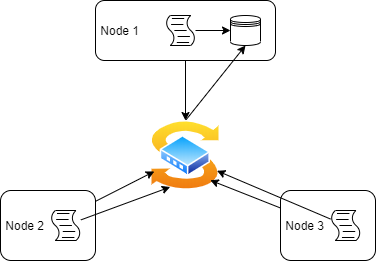

# Introduction
Cluster Monitoring Agent is an internal tool that 
monitors nodes and servers that are connected via 
a switch and are able to communicate using IPv4 
addresses. It is used to gather information on the 
hardware specification and recourse usage of each 
node in the cluster. This data is stored in an RDBMS 
database in two different tables, one for the host 
information and the other for the host usage. The 
Cluster Monitoring Agent is implemented using a 
combination of bash scripts and SQL queries that 
work in conjunction to gather information and store 
it in a database. The data gathered by the monitoring 
agent will aid the infrastructure team in making 
business decisions regarding future resource planning. 


# Quick Start
- Start a psql instance using psql_docker.sh
``` bash 
./linux_sql/scripts/psql_docker.sh start 
```
- Create tables using ddl.sql
``` bash
psql -h psql_host -U psql_user -d host_agent -f /linux_sql/sql/ddl.sql 
```
- Insert hardware specs data into the db using host_info.sh
``` bash
/linux_sql/scripts/host_info.sh psql_host psql_port db_name psql_user psql_password 
```
- Insert hardware usage data into the db using host_usage.sh
``` bash
/linux_sql/scripts/host_usage.sh psql_host psql_port db_name psql_user psql_password 
```
- Crontab setup
``` bash
# Run command to edit crontab jobs
crontab -e

# Insert below statement into crontab
* * * * * bash [path]/host_usage.sh localhost 5432 host_agent postgres password > /tmp/host_usage.log
```

# Architecture Diagram


# Database Modeling
The database, host_agent, is made up of two tables, host_info which contains the 
hardware specifications of the computer, and host_usage which containes the 
resource usage of the computer. \
The `host_info` table contains the following columns. It is only
executed once as hardware specifications are expected to be constant
- `id`: A unique identifier corresponding to each node in the cluster, automatically incremented every time a new entry is added
- `hostname`: A unique character string that contains the hostname of the corresponding node
- `cpu_number`: The number of CPU cores of the corresponding node
- `cpu_architecture`: The architecture of the CPU of the corresponding node
- `cpu_model`: The CPU model of the corresponding node
- `cpu_mhz`: The clock speed of the CPU of the corresponding node in MHz
- `L2_cache`: The cache size of the corresponding node in kB
- `total_mem`: The amount of RAM of the corresponding node in kB
- `timestamp`: The date and time at which the data was obtained

The `host_usage` table contains information on the resource consumption of the 
current node. It can be collected manually, and given the dynamix nature of computer
resource usage this data is being collected every minute. This table contains the 
following columns.
- `timestamp`: The date and time at which the data was obtained
- `host_id`: The unique identifier corresponding to each node in the cluster, automatically added via the `host_info` table as a foreign key.
- `memory_free`: The amount of free memory in mB of the corresponding node 
- `cpu_idle`: The percentage of CPU time spent in idle of the corresponding node
- `cpu_kernel`: The percentage of CPU time spent running kernel code of the corresponding node
- `disk_io`: The number of disk input and output of the corresponding node
- `disk_available`: The amount of space available on the disk in mB of the corresponding node


## Script Descriptions
- psql_docker.sh \
`psql_docker.sh` is a script that is used to create, start or stop a docker container. In order to create a new container, you must provide a username and password, otherwise, to start or stop now additional arguments are required. 
- ddl.sql \
`ddl.sql` is a query that connects to the `host_agent` database and creates the two tables: `host_info` and `host_usage` with their appropriate columns.
- host_info.sh \
`host_info.sh` is a script that is used to collect the hardware specification and insert that data into the `host_info` table that is inside the `host_agent` database. This script is only run once.
- host_usage.sh \
`host_usage.sh` is a script that is used to collect the resource usage data and insert that data into the `host_usage` table that is inside the `host_agent` database. This script can be run manually but is also executed once every minute.
- crontab \
crontab is the tool that is used to automate the aforementioned `host_usage.sh`. This is done by inserting the script you wish to run inside the crontab jobs as demonstrated below in the usage section.
- queries.sql \
`queries.sql` is a set of queries that aim to answer business questions. The first of which is to group each host by their CPU number, and sort them based on their total memory. The second is to determine the average memory usage of each node over 5-minute intervals. 

## Script Usage
1. Database and Table initialization \
    First the PSQL instance must be created and the Database must be initialized
    ``` bash
    # From the home directory, provision and start a PostgreSQL instance with Docker with a username and password
    ./linux_sql/scripts/psql_docker.sh create username password
    
    # Initialize the database and tables
    psql -h psql_host -U username -W -f linux_sql/sql/ddl.sql
    ```
1. `host_info.sh` usage \
    `host_info.sh` is only run once so we can run it from the command line as follows, in order to add the host hardware specifications to the `host_info` table
    ``` bash
    # Provide the arguments for the PSQL host, the PSQL port, the database name, and the username and password used to provision the PSQL instance
    ./linux_sql/scripts/host_info.sh psql_host psql_port db_name username password
    ```
1. `host_usage.sh` usage \
    `host_info.sh` can be run manually from the command line as follows, in order to add the host resource usage to the `host_usage` table
    ``` bash
    # Provide the arguments for the PSQL host, the PSQL port, the database name, and the username and password used to provision the PSQL instance.
    ./linux_sql/scripts/host_usage.sh psql_host psql_port db_name username password
    ```
1. crontab setup \
    Crontab is used to run the `host_usage.sh` script once a minute and is implemented using the following commands
    ``` bash
    # Run command to edit crontab jobs
    crontab -e
    
    # Insert below statement into crontab
    * * * * * bash [path]/host_usage.sh localhost 5432 host_agent postgres password > /tmp/host_usage.log
    
    # Verify that the job was added
    crontab -l
    
    # Verify that the script is being run as intended
    cat /tmp/host_usage.log
    ```
## Improvements 
- Implement a dashboard that allows the user to see the performance of each node at a glance. This can provide a visualization of each computer's usage over time.
- Include a shell script that can automate all of the scripts and queries used in this project so that it is more user friendly. It can be implemented so that all of the parameters are passed to single executable `.sh` file, which will provision a psql instance and create a database that houses all of the information from the executed `host_usage.sh` and `host_info.sh` files. 
- Optimize the crontab tool so that it only runs during times at which the servers are underuse, and stop during prolonged periods in which they are idle 